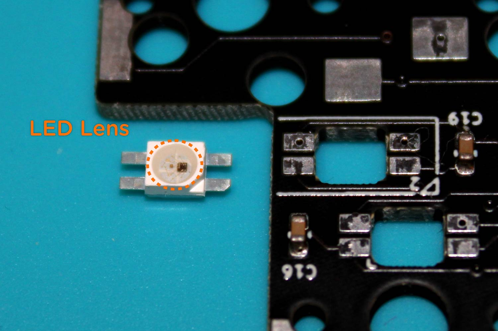
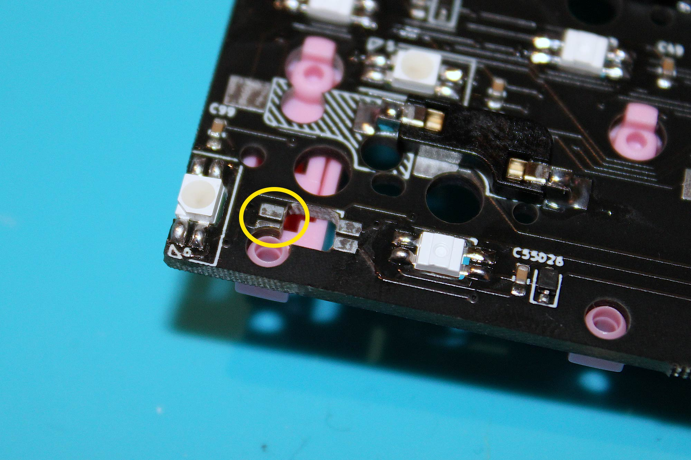
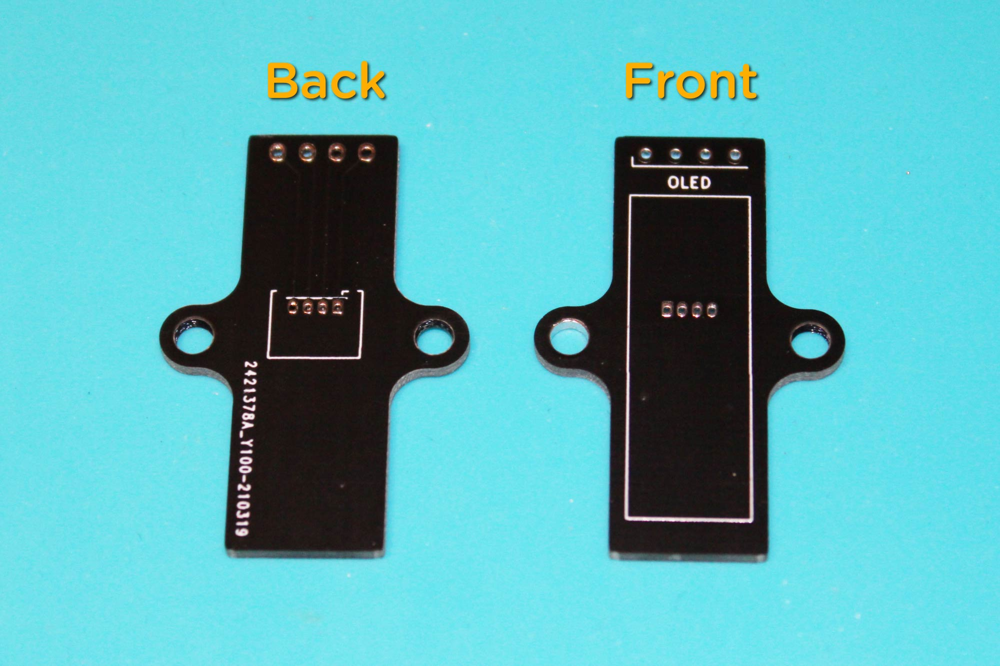
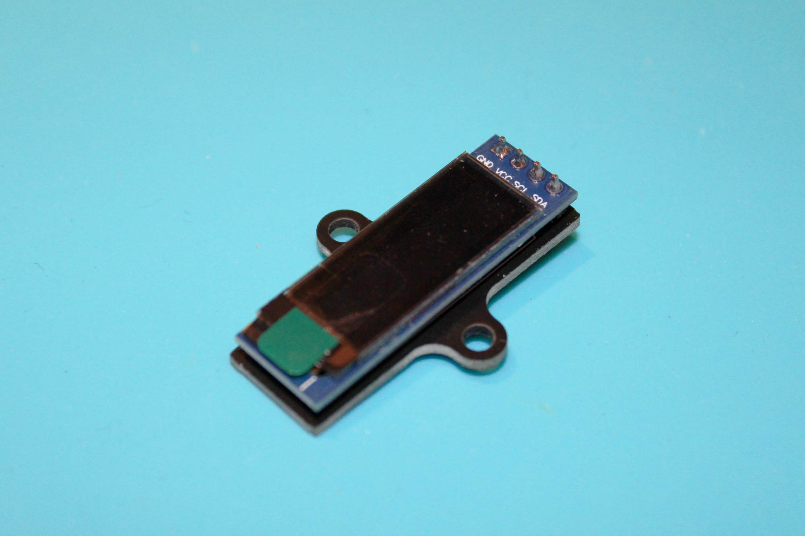
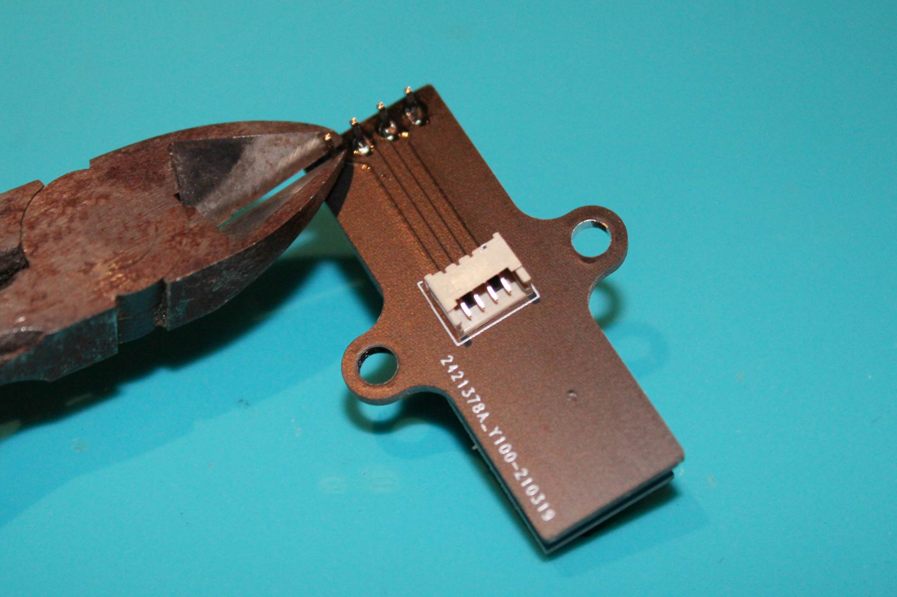
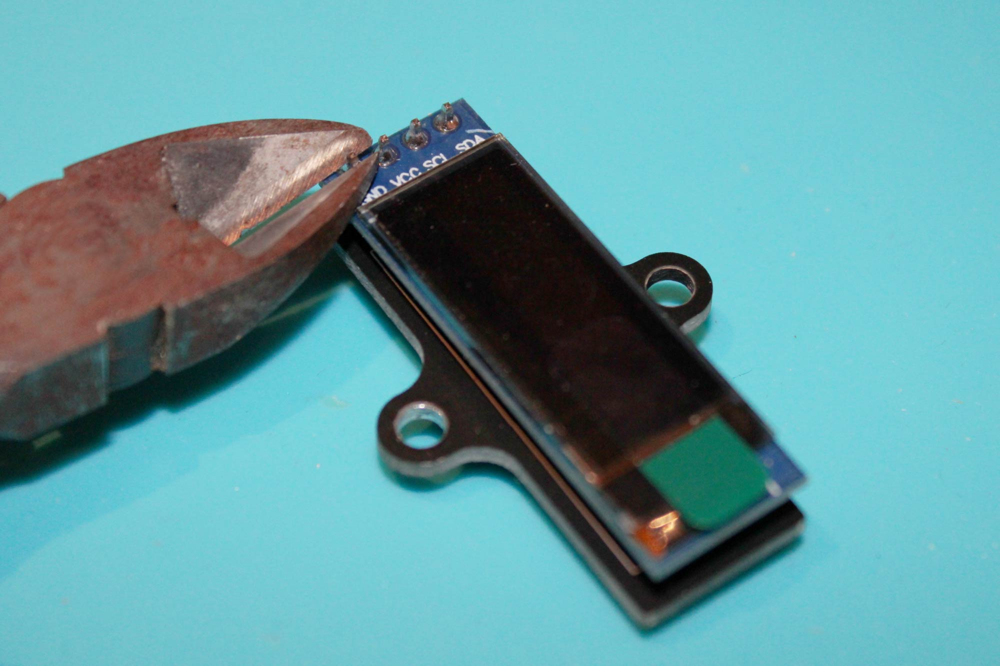
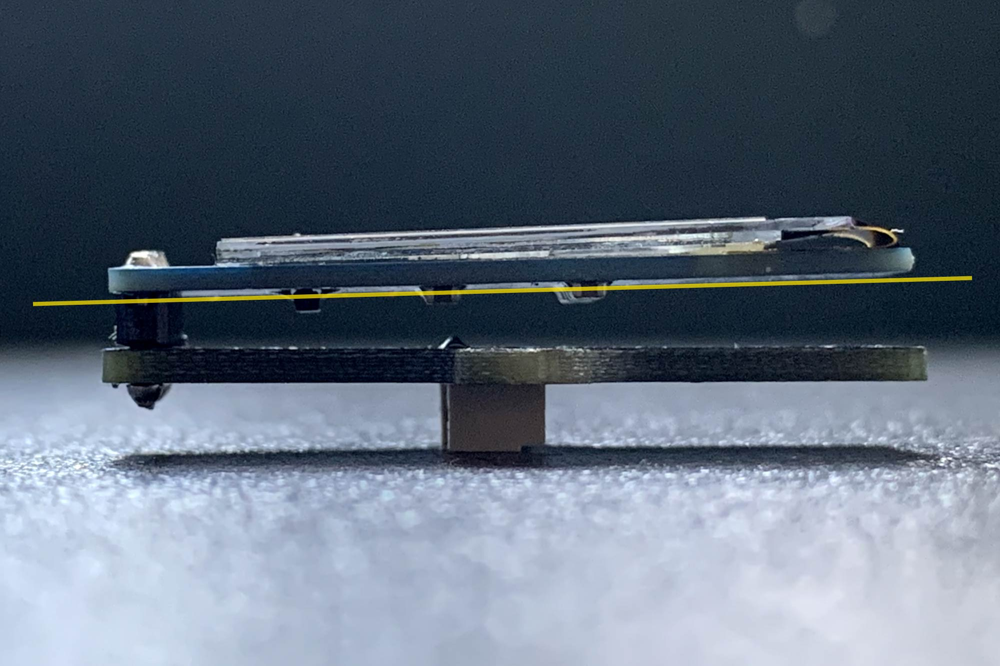

# UM-80 Assembly Guide

## **Content of UM-80 Kit**

**Printed Parts** 
- 2 x Top Cases
- 2 x Rear Covers
- 2 x Side Panels
- 1 x Rotary Encoder Knob

**Electronics**
- 1 x Main PCB (Left & Right)
- 1 x OLED Screen PCB
- 1 x OLED Screen
- 2 x 4 Pins Sockets
- 1 x 4 Pins Cable
- 1 x Encoder
- 120 x SK6812MINI RGB LED (Only 100 are required)
- 90 x Hot swap sockets (Only 87/88 are required)
- 2 x TRRS PJ-320A

**Fasteners**
- 30 x M2 3mm screws (Only 26 are required)
- 15 x M2 3mm Standoffs (Only 13 are required)
- 15 x M2 washers (Only 13 are required)
- 20 x M3 5mm screws (Only 16 are required)
- 5 x M3 16mm screws (Only 4 are required)
- 5 x M3 25mm screws (Only 4 are required)

**Miscellaneous**
- 1 x FR4 Plates (Left & Right)
- 8 x Rubber feet

---

## **Test the PCBs before soldering**

All PCBs are tested prior shipping, but it is good practice to make sure they are working before soldering. Both PCBs should be recognised as keyboard input device when connected to a computer. Plug in one half and test by shorting switch pins with tweezers. After testing one half, disconnect the first and test the other half.

**Don’t panic if the right side PCB outputs the wrong key for that switch location or not registers some of the keys, as the firmware is set to left as master. As long as both halves produce some output you have verified the PCBs are working.**

## **Assembling the Main PCBs**

**_Blue = In-switch LEDs_**

**_Orange = Panel LEDs_**

There are 41 in-switch and 7 panel LEDs on the left half. 45 in-switch (46 for split backspace) and 7 panel LEDs on the right side.

## **Panel LEDs**

To solder side panel LEDs, the LED lens should be facing up. Align the marking on the PCB and the LED then solder. Repeat the same process for the remaining side panel LEDs.

## **In-switch LEDs**

To solder in-switch LEDs, the LED lens should be facing down. Align the markings on the PCB and the LED then solder. Repeat the same process for the remaining in-switch LEDs.

When soldering LEDs for Spacekey on the left and Backspace on the right, pick one of the two layouts shown above. Be sure to only solder one layout.

## **Hot swap sockets**

Place sockets as shown in the photo. When soldering sockets for Spacekey on the left and Backspace on the right, refer to your chosen layout from the previous step for correct placement. Be sure to only solder sockets to one layout.

There are 4 sockets on the edge of the right half that need modification prior to soldering.

Spread the right pins of the socket as shown in the photo and then solder.

## **TRRS Jacks**

Place the jack on the underside of the PCB (the same side you just soldered sockets to) then solder.

## **OLED Screen Connector**

OLED screen connector is located on the left half.

Insert it on the underside of the PCB and then solder.

## **Buzzer**
_Optional, AST1109MLTRQ buzzer is not included in the kit_

Buzzers are located on the top sides of each PCB. Only solder a buzzer on the master half (Left half by default. Only solder the buzzer to the half that will be plugged into your PC via USB-C).

- _Audio is not enabled by default._

- _QMK does not support speaker on the on slave half._

- _Audio features take a large amount of memory, some other features may have to be disabled to allow space for it._

- _Buzzer is wired to IO pin B6._

AST1109MLRQ is non-polarity, solder anyway up.

---
## **Test the PCBs**

Connect both halves with TRRS cable **_first_**, and then connect USB cable to the **_left_** **_half_**.

**DO NOT PLUG/UNPLUG TRRS CABLE WHEN POWER IS ON (I.E. WHEN USB CABLE IS CONNECTED), IT CAN SHORT THE CONTROLLER.**

Check that all LEDs are working before proceeding to the next step.

### **Troubleshooting LEDs**

The LEDs are wired in series, see photos for the order.

If some of the LEDs do not light up or appear to be faulty, it’s most likely that something is wrong with the adjacent LEDs in the series.
For example, if LED 24-39 doesn’t light up, check LED 23 and 24.
- Check solder joints

- Make sure there is a capacitor, it may have got knocked off during handling

- It’s not unusual to encounter a faulty RGB LED, replace it.

- Make sure the right side is connected via TRRS cable.

Once all LEDs are working, move on to the next step

---

## **Encoder**

Encoder is located on the right half.

Insert encoder to the front of the PCB, solder it from the underside of the PCB.

## **Stabilisers**

 

When installing screw-in stabiliser for Spacekey on the left half, use a washer/electrical tape to isolate the screw and the LED contacts to prevent shorting.

## **Mounting PCB to plate**

There are 6 mounting points on the left side and 7 points on the right side.

Secure the standoffs to the plate with washers and M2 screws.

Insert switches to plate and PCB. Switches should seat flush on the PCB. 

Secure PCB to plate with M2 screws. 

---
## **Test the PCBs**

Connect both halves with TRRS cable **_first_**, and then connect USB cable to the **_left_** **_half_**.

**DO NOT PLUG/UNPLUG TRRS CABLE WHEN POWER IS ON (I.E. WHEN USB CABLE IS CONNECTED), IT WILL SHORT THE CONTROLLER.**

Confirm that all switches and the encoder are working before proceeding to the next step.

### **Troubleshooting Encoder/Switches**

**Encoder**
- Check solder joints.
- Make sure there is a diode, it may have got knocked off during handling.

**Switches**
- Dismount the switch and check for bent pins, straighten the pins with pliers if necessary.
- Check hot swap socket solder joints.
- Check for diode on near the switch, it may have got knocked off during handling.

---

## **Soldering OLED screen PCB**

Note the front and back of the PCB

Insert the 4 pin connector to the back of the PCB. Align it with the marking on the PCB and then solder each pin from the front.

### **Be sure to solder correctly in this step, as there will be no access to the solder joints once the OLED screen is in place.**

Insert the short pins of the OLED screen header through the back of the OLED PCB then solder from the front. Then place the long pins of the screen header through the black mounting PCB and solder each pin from the underside.

Trim header pins short on both side. 

Be sure the pins on the front are not protruding higher than the screen. Also, tilt-up the OLED screen slightly. Otherwise, there will be a gap between the case and the screen.

Attached the OLED screen to the left case with 2 M3 5mm screws.

---

## **Mount PCB assembly to case**

There are 5 mounting points on both side. Secure the PCB with the M3 5mm screws.

---

## **Connecting OLED screen**

Connect OLED screen with the 4 pin cable.

## **Case Assembly**

Place the side panel onto the case.

**Default Cover**

Stack default cover onto the case with side panal, then fasten it with 5mm and 16mm screws.

**With tenting risers**

Stack the raiser and default cover onto the case with side panal, then fasten it with 16mm and 25mm screws.

---

---
