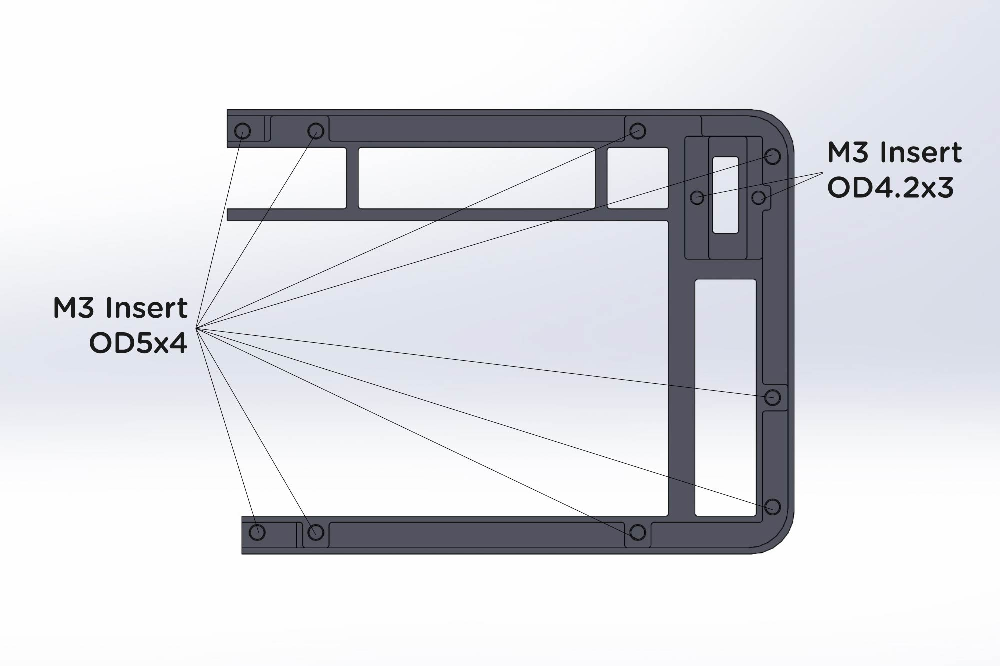

# **Print guide**

## **Print files**

There are 7 parts need to be printed in order to complete the build.
- Left & right cases
- Left & right covers
- Left & right panels
- Knob
- Risers (Optional)

## **Recommended print setting**

Print Orientation

- Minimum build volume: 200 x 145 x 23mm
- 0.4mm Nozzle
- 0.2mm layer height
- ≥ 15% infill

All parts are designed to be printed with 0.4 nozzle at 0.2mm layer height without support, see print orientation.

## **Thread Inserts**

PCB kit comes with heat-set threaded inserts for both halves. All mount holes are designed to accept M3 OD5 x H4 except OLED mounts which is OD4.2 x H3. See above for details.
